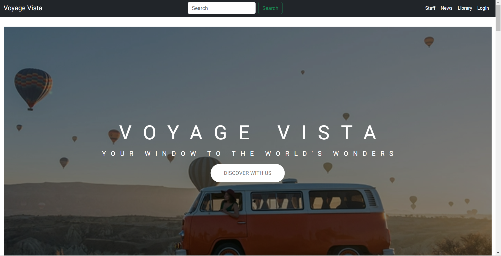
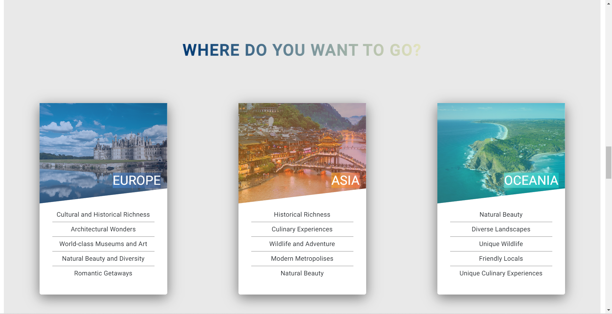
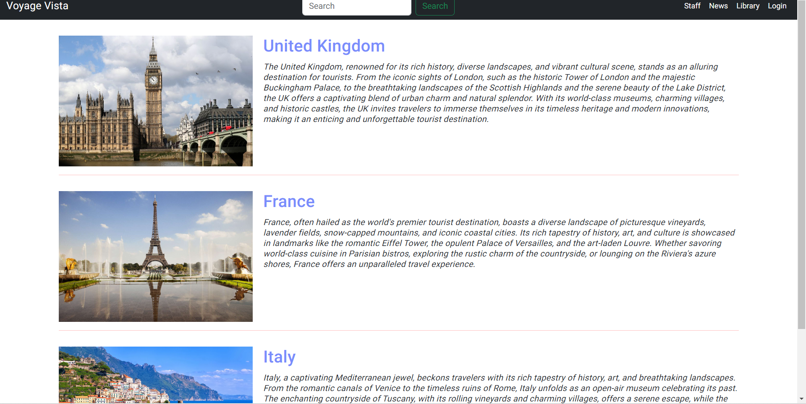

# VoyageVista

Welcome to the Traveling Website repository! This is a place for everyone who loves to travel. Here, you can find, plan, and share your travel stories and adventures.

# Features

## Admin Management Tools:

- Tourist Attraction & Places: Admins can add, update, or remove tourist attractions and interesting spots.
- Customer Information: Admins have tools to handle and manage customer information.

## Authentication for Admin:

- Login & Logout: Secure and straightforward.
- Auto Login & Auto Logout: For convenience and security, admins will be remembered upon returning to the site. However, for safety, the session will expire after a period of inactivity.

## User Experience:

- Tourist Attractions & Countries: Users can browse and explore details about different tourist attractions and countries, making it easier to plan their next adventure.

# Tech Stack & Libraries
This project is built using Angular, Bootstrap, Node.js, MongoDB and a combination of popular libraries and middlewares:

- Express.js: Fast, unopinionated web application framework.
- Mongoose: Elegant MongoDB object modeling for Node.js.
- body-parser: Middleware to parse incoming request bodies.
- cors: Middleware to enable CORS with various options.
- multer: Middleware for handling multipart/form-data, which is primarily used for uploading files.
- jsonwebtoken (JWT): An implementation of JSON Web Tokens.
- crypto: Provides cryptographic functionality for secure data handling.
- Bootstrap: Responsive front-end framework.
- Angular Material: simple front-end interface for admin management.

# Getting Started
## Clone the Repository:
- git clone https://github.com/phthien241/Travel-Website-Voyage-Vista
- cd Restaurant-TavolaItaliano
## Install Dependencies:
- npm install
## Configuration:
- Ensure to put your MongoDB link for the database.
## Start the Application:
- run node server.js
- run ng serve

# Demo

